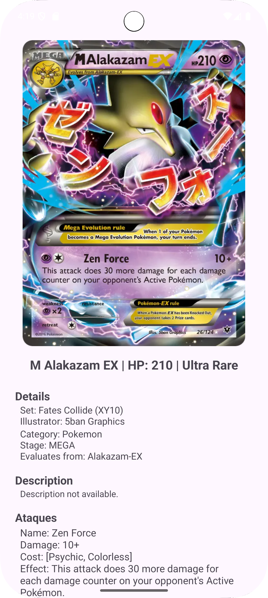

# 🔎 Pokémon TCG Search App

Um aplicativo nativo para Android que permite aos usuários navegar, pesquisar e visualizar detalhes completos de mais de 21.000 cartas do Pokémon Trading Card Game (TCG), utilizando a API pública TCGdex.

## ✨ Funcionalidades Principais

* **Galeria de Alta Performance:** Exibição de mais de 21.000 cartas em um layout de grade (`GridLayoutManager`), carregando dados.
* **Busca em Tempo Real:** Filtragem instantânea das cartas com base no nome, executada em *background* (`ExecutorService`) para evitar travamento da UI.
* **Visualização de Detalhes:** Navegação da galeria para uma tela de detalhes (`DetalhesActivity`), que faz uma busca específica do objeto `Card` completo.
* **UI Dinâmica:** Geração dinâmica de componentes (`LinearLayout`) para exibir listas complexas como Ataques, Fraquezas e Variantes, ajustando-se a qualquer tipo de carta.
* **Carregamento de Imagens Seguro:** Uso do Glide para carregamento de imagens por URL, com lógica de correção de URL (`/high.webp`) e tratamento robusto de erros.

## 🛠️ Tecnologias Utilizadas (Tech Stack)

* **Linguagem:** Java
* **Plataforma:** Android SDK
* **Rede/API:** TCGdex-Java-SDK (Para acesso aos dados)
* **Assincronia:** `ExecutorService` e `runOnUiThread()` (Para gerenciamento eficiente de *threads*)
* **Imagens:** Glide (Para carregamento e cache de imagens)
* **Serialização:** Gson (Para manipulação de JSON, embora principalmente dentro do SDK)
* **Interface:** `RecyclerView`, `GridLayoutManager`, `SearchView`

## 🏗️ Destaques da Arquitetura

O projeto segue um padrão robusto de desenvolvimento Android para garantir a estabilidade e performance:

* **Separação de Responsabilidades (SOAP):** O projeto utiliza `CardResume` (dados leves) para a lista principal e faz a busca do objeto `Card` (dados pesados) apenas sob demanda na tela de detalhes.
* **Programação Assíncrona:** Todas as operações de I/O (busca de dados da API) são executadas fora do *Main Thread* (Thread Principal) usando `ExecutorService` e o `runOnUiThread()` garante que a UI seja atualizada de forma segura.
* **Robustez:** Implementação de verificações de nulos (`Null Checks`) em todos os campos opcionais da API para evitar *NullPointerExceptions* (NPE) e um tratamento de erro com `Toast` no sistema de busca.

## 🚀 Instalação e Uso

### Pré-requisitos

* Android Studio (Versão mais recente recomendada)
* Dispositivo ou Emulador rodando Android 7.0 (API 24) ou superior.

### Instalação

1.  **Clone o Repositório:**
    ```bash
    git clone https://github.com/lemirving/PokemonTCG_Search.git
    ```
2.  **Abrir no Android Studio:** Abra o projeto no Android Studio. O Gradle fará o download automático de todas as dependências (Glide, Gson, TCGdex-SDK).
3.  **Permissões de Rede:** A permissão `android.permission.INTERNET` já está configurada no `AndroidManifest.xml`.
4.  **Executar:** Execute o projeto em um emulador ou dispositivo.

## 📷 Demonstração Visual

### Galeria Principal e Busca

A tela principal exibe mais de 21.000 cartas em um layout de grade de 2 colunas, carregando apenas os dados essenciais (`CardResume`) para garantir a velocidade. A busca é executada em tempo real (`ExecutorService`) sobre a lista pré-carregada.

### Detalhes da Carta

Ao clicar em um item, o aplicativo navega para a `DetalhesActivity`, onde é feita uma busca única do objeto **`Card`** completo. Todos os atributos (Ataques, Fraquezas, Variantes) são gerados dinamicamente (`LinearLayout`), garantindo que a tela se ajuste a qualquer tipo de carta.
<div align="center">
    
    &nbsp; &nbsp; &nbsp; &nbsp; 
</div>


## 🤝 Contato
| **Meios de Contato** | |
| :--- | :--- |
| **GitHub** | [lemirving](https://github.com/lemirving) |
| **Email** | dev.lemirving@gmail.com |


## 🙏 Agradecimentos

Este projeto utiliza dados da [Pokémon TCG API by TCGdex](https://api.tcgdex.net/).

Desenvolvido por Irving Lemuel Santos Riça.
